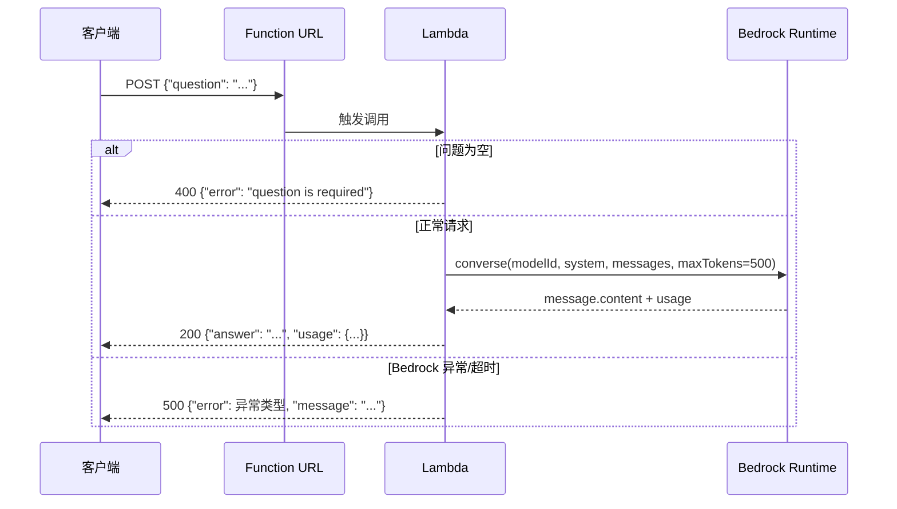
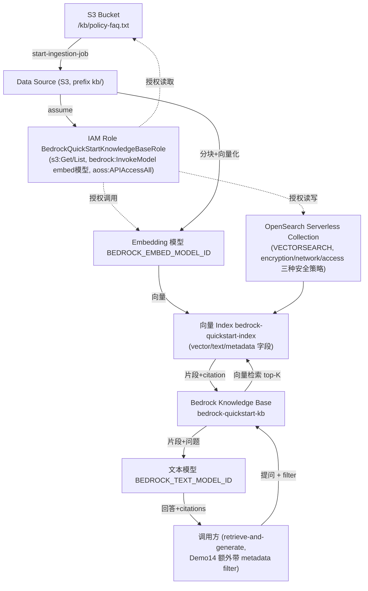
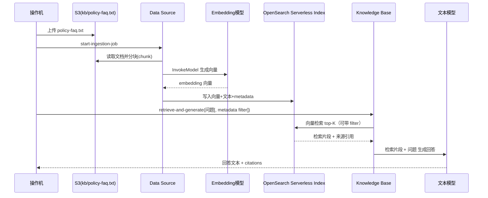
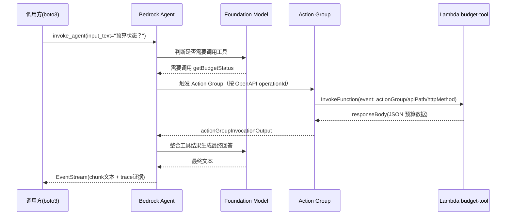

# 架构文档

本仓库包含 18 个 Demo（`docs/demo01-*.md` ~ `docs/demo18-*.md`），这里不做全量架构图汇总，只对其中组件交互较复杂、值得可视化的 Demo 提供架构图；其余 Demo 请直接看对应的 `docs/demoNN-*.md`。

选中的 3 个 Demo：

- **Demo07** — Lambda 与 API Gateway 封装最小 Bedrock 应用：唯一一个把 Bedrock 调用封装成端到端 HTTP 应用（API Gateway/Function URL → Lambda → Bedrock Runtime）的 Demo，涉及 IAM 执行角色、应用层错误处理与超时配置
- **Demo13**（含 Demo14 的深化用法）— Knowledge Bases 构建 RAG：S3 文档 → Ingestion → OpenSearch Serverless 向量存储 → retrieve-and-generate，涉及 IAM Role、Embedding 模型、OpenSearch Serverless 三类安全策略等多个组件的编排
- **Demo15** — Agents for Bedrock + Lambda Action Group：Agent 判断是否调用工具 → 触发 Lambda Action Group → 工具结果回传给模型生成最终回答，是一条真正跨服务（Bedrock Agent + Lambda + IAM 权限边界）的调用链路

其余 Demo（L100 的 Converse/流式/多模态/结构化输出，L200 的日志/IAM/Guardrails/Tool Use，L300 的跨区推理重试/批量吞吐/评估成本）都是单一 API 调用或单一服务配置，交互链路简单，不再单独画图。Demo14 复用 Demo13 创建的全部资源（同一个 Knowledge Base/Data Source/OpenSearch 集合），只是检索请求多了 `metadata filter` 参数、应用侧多了 citation 校验，架构与 Demo13 相同，不重复画图。

---

## Demo07 — Lambda 与 API Gateway 封装最小 Bedrock 应用

把 Converse API 封装成一个最小 HTTP 应用：客户端请求经 Function URL（或 API Gateway）到达 Lambda，Lambda 用 `boto3 bedrock-runtime.converse()` 调用文本模型并返回企业政策助手答案。Lambda 执行角色的 `bedrock:InvokeModel` 权限精确限定到指定模型 ARN（最小权限），应用层对空问题、超时、模型异常都做了显式处理。

```mermaid
flowchart LR
  Client["客户端\n(curl / 前端应用)"]
  Gateway["Lambda Function URL\n(auth-type=AWS_IAM)\n或 API Gateway"]
  Lambda["Lambda: bedrock-policy-assistant\n(Python 3.12, timeout=30s)"]
  Role["IAM Role: bedrock-policy-assistant-role\n(bedrock:InvokeModel 限定到指定模型ARN\n+ CloudWatch Logs 写入权限)"]
  Bedrock["Bedrock Runtime\nconverse() + system prompt"]
  Logs["CloudWatch Logs"]

  Client -->|"POST {question}"| Gateway --> Lambda
  Lambda -->|assume| Role
  Role -.授权.-> Bedrock
  Lambda -->|converse(modelId, system, messages)| Bedrock
  Bedrock -->|answer + usage| Lambda
  Lambda -->|"200 {answer, usage} / 400 空问题 / 500 异常"| Client
  Lambda --> Logs
```



---

## Demo13 — Knowledge Bases 构建 RAG（含 Demo14 metadata filter 用法）

企业政策文档上传到 S3，Knowledge Base 的 Data Source 读取文档、分块并调用 Embedding 模型生成向量，写入 OpenSearch Serverless 的向量索引；查询时 `retrieve-and-generate` 先做向量检索拿到相关片段（Demo14 在这一步加了 `metadata filter`，按 `department` 等字段限定检索范围），再把片段和问题一起交给文本模型生成带 citation 的回答。整条链路由一个信任 `bedrock.amazonaws.com` 的 Knowledge Base Service Role 串联授权。



数据同步（ingestion）与检索问答（retrieve-and-generate）的完整时序：



## Demo15 — Agents for Bedrock + Lambda Action Group

创建一个最小 Bedrock Agent，Instruction 要求它在用户问预算问题时必须调用工具。Agent 通过 Action Group（OpenAPI schema 定义的 `/budget/status` 接口）把工具执行委托给一个 Lambda 函数；Lambda 只是返回一段固定的预算 JSON。整个调用链靠两层授权拼起来：Agent 执行角色允许它 `InvokeModel` 和 `InvokeFunction`，Lambda 的 resource policy（`source-arn` 限定到这个 Agent）允许 Bedrock 服务反向调用它。验证方式是从 `invoke_agent` 返回的 `EventStream` 里找 `trace` 事件确认 Lambda 真的被触发，而不只是看最终文本。

```mermaid
flowchart TB
  AgentRole["IAM Role BedrockQuickStartAgentRole\n(bedrock:InvokeModel + lambda:InvokeFunction)"]
  Agent["Bedrock Agent bedrock-quickstart-agent\n(foundation model + instruction)"]
  ActionGroup["Action Group BudgetTools\n(OpenAPI schema: GET /budget/status)"]
  Alias["Agent Alias quickstart"]
  Lambda["Lambda bedrock-quickstart-budget-tool\n(返回预算状态 JSON)"]
  LambdaRole["IAM Role\n(AWSLambdaBasicExecutionRole)"]
  Perm["Lambda resource policy allow-bedrock-agent\n(principal=bedrock.amazonaws.com, source-arn=该Agent)"]
  Client["调用方 (boto3 invoke_agent)"]
  Model["Foundation Model BEDROCK_TEXT_MODEL_ID"]

  Client -->|invoke_agent(sessionId, inputText)\n经由| Alias
  Alias --> Agent
  Agent -->|assume| AgentRole
  AgentRole -.->|授权调用| Model
  AgentRole -.->|授权调用| Lambda
  Agent -->|判断需要调用工具| ActionGroup
  ActionGroup -->|action-group-executor| Lambda
  Lambda -->|assume| LambdaRole
  Perm -.->|允许 Agent 反向调用| Lambda
  Lambda -->|responseBody JSON| ActionGroup
  ActionGroup -->|工具结果| Agent
  Agent -->|整合结果生成最终回答| Model
  Agent -->|EventStream(chunk文本+trace证据)| Client
```

Agent 判断调用工具、触发 Lambda、整合结果的完整时序：


